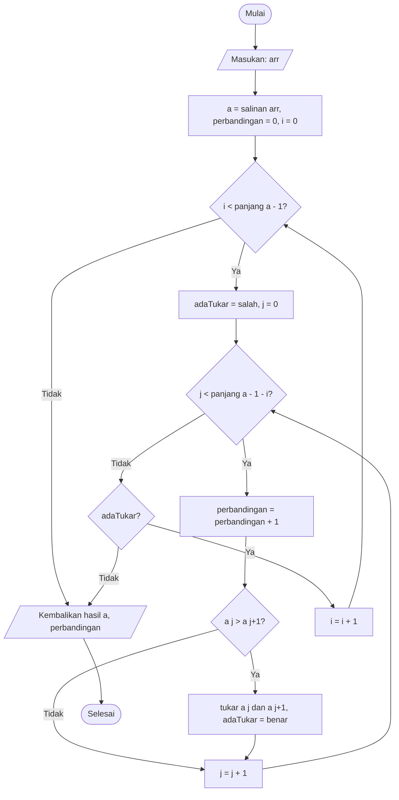

# Flowchart Bubble Sort

```mermaid
flowchart TD
    A([Mulai]) --> B[/Masukan: arr/]
    B --> C[a = salinan arr, perbandingan = 0, i = 0]
    C --> D{i < panjang a - 1?}
    D -- Tidak --> M[/Kembalikan hasil a, perbandingan/]
    D -- Ya --> E[adaTukar = salah, j = 0]
    E --> F{j < panjang a - 1 - i?}
    F -- Tidak --> K{adaTukar?}
    F -- Ya --> G[perbandingan = perbandingan + 1]
    G --> H{a j > a j+1?}
    H -- Ya --> I[tukar a j dan a j+1, adaTukar = benar]
    H -- Tidak --> J[j = j + 1]
    I --> J
    J --> F
    K -- Ya --> L[i = i + 1]
    K -- Tidak --> M
    L --> D
    M --> Z([Selesai])
```