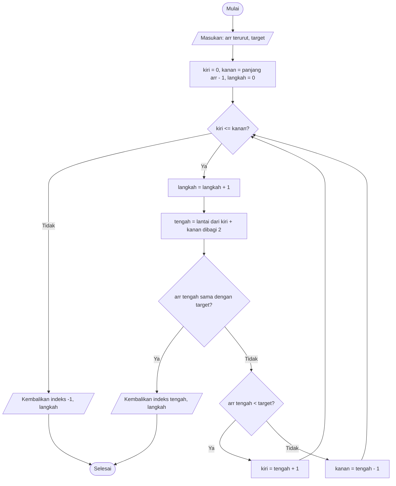

# Flowchart Binary Search

```mermaid
flowchart TD
    A([Mulai]) --> B[/Masukan: arr terurut, target/]
    B --> C[kiri = 0, kanan = panjang arr - 1, langkah = 0]
    C --> D{kiri <= kanan?}
    D -- Tidak --> J[/Kembalikan indeks -1, langkah/]
    D -- Ya --> E[langkah = langkah + 1]
    E --> F[tengah = lantai dari kiri + kanan dibagi 2]
    F --> G{arr tengah sama dengan target?}
    G -- Ya --> K[/Kembalikan indeks tengah, langkah/]
    G -- Tidak --> H{arr tengah < target?}
    H -- Ya --> I[kiri = tengah + 1]
    H -- Tidak --> L[kanan = tengah - 1]
    I --> D
    L --> D
    K --> Z([Selesai])
    J --> Z
```