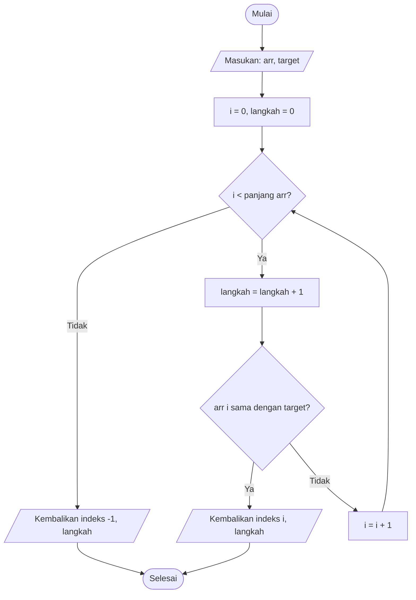

# Flowchart Linear Search

```mermaid
flowchart TD
    A([Mulai]) --> B[/Masukan: arr, target/]
    B --> C[i = 0, langkah = 0]
    C --> D{i < panjang arr?}
    D -- Tidak --> H[/Kembalikan indeks -1, langkah/]
    D -- Ya --> E[langkah = langkah + 1]
    E --> F{arr i sama dengan target?}
    F -- Ya --> G[/Kembalikan indeks i, langkah/]
    F -- Tidak --> I[i = i + 1]
    I --> D
    G --> Z([Selesai])
    H --> Z
```